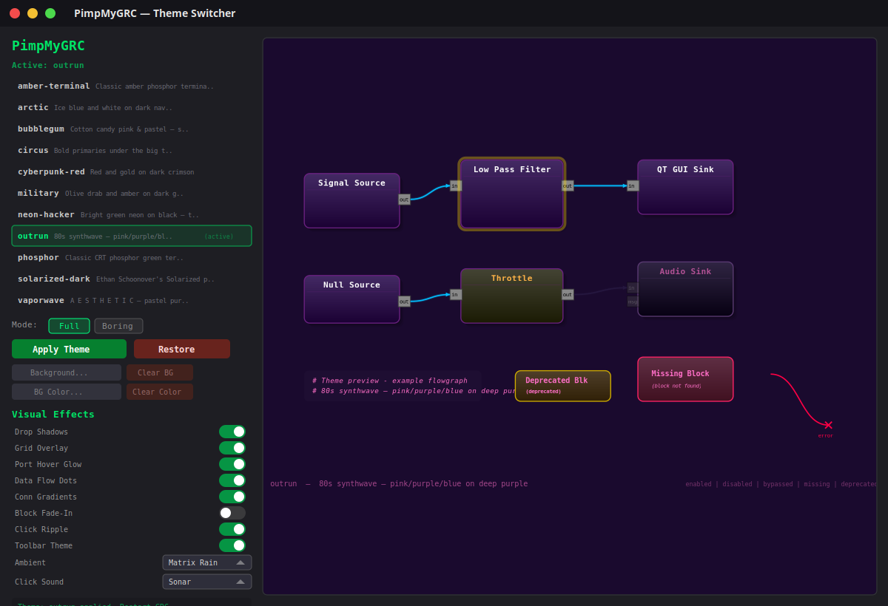

# PimpMyGRC

I started out wanting the simplest thing imaginable in GNU Radio: a plain black background so my eyes could survive late-night debugging, and somehow that tiny request snowballed into a full-blown Geocities monstrosity with loud gradients, chaotic accents, and enough visual noise to make every flowgraph feel like a 1999 fan page. It is the definition of a first-world problem: I have powerful SDR tools, real technical work to do, and my biggest daily obstacle is that my interface now looks like it lost a fight with a glitter GIF archive, all because I tried to make one harmless cosmetic tweak.

Themes and visual effects for **GNURadio Companion 3.10**.

## What it does

Replaces GRC's stock look with fully themed colors, block rendering, connections, and ports. Includes a GTK4 theme switcher with a live animated preview so you can see exactly what you're getting into before you commit.




## Themes

| Theme | Vibe |
|-------|------|
| **neon-hacker** | Bright green neon on black |
| **phosphor** | Classic CRT phosphor green terminal |
| **outrun** | 80s synthwave — pink/purple/blue on deep purple |
| **cyberpunk-red** | Red and gold on dark crimson |
| **arctic** | Ice blue and white on dark navy |
| **solarized-dark** | Ethan Schoonover's Solarized palette |
| **military** | Olive drab and amber on dark green |
| **vaporwave** | A E S T H E T I C — pastel purple, pink & teal |
| **amber-terminal** | Classic amber phosphor — warm retro glow |
| **bubblegum** | Cotton candy pink & pastel |
| **circus** | Bold primaries under the big top |

## Visual Effects

All toggleable per-effect. Mix and match.

- **Ambient particles** — matrix rain, snow, bubbles, confetti, sparks, dust, fire, fireflies, lightning, starfield, scanline, glitch
- **Click ripple** — expanding rings when you select a block
- **Click sounds** — sonar, click, coin, laser, blip (synthesized, no audio files)
- **Data flow dots** — colored dots traveling along connections
- **Connection gradients** — smooth color blend between port types
- **Port hover glow** — pulsing highlight on port mouseover
- **Block fade-in** — entrance animation for new blocks
- **Drop shadows** — layered soft shadows behind blocks
- **Grid overlay** — subtle themed grid on the canvas
- **Toolbar theming** — CSS styling for menus and toolbars

## Usage

```
# Interactive GTK4 theme switcher (recommended)
./pimpmygrc.py

# CLI
./pimpmygrc.py list
./pimpmygrc.py apply outrun
./pimpmygrc.py apply outrun --mode colors   # safer, colors + blocks only
./pimpmygrc.py restore                      # revert to stock GRC
./pimpmygrc.py check                        # verify installed state
```

## How it works

Themes are plain Python files that replace GRC's canvas rendering modules (`colors.py`, `block.py`, `connection.py`, `port.py`). Originals are backed up on first run and can be restored at any time. Effects are stored in `~/.gnuradio/grc_effects.json` and injected via patched `DrawingArea.py` and `effects.py`.

No external dependencies beyond what GRC already ships with. Sound effects are synthesized in-memory and played via `aplay`.

## Requirements

- GNURadio 3.10 with `gnuradio-companion`
- Python 3
- GTK4 (for the interactive theme switcher)
- `aplay` (for click sounds, optional)
